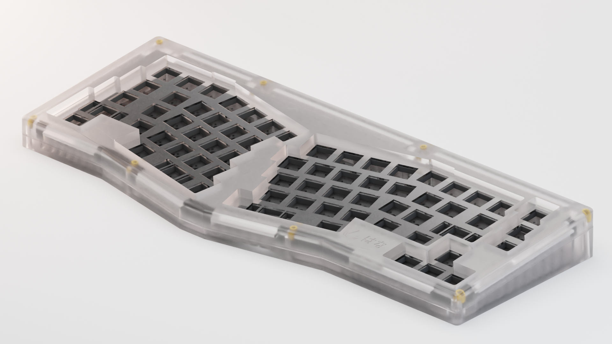

# Hirakusu

An open-sourced Alice/Arisu style keyboard case. Modified from [FateNozomi's Arisu](https://github.com/FateNozomi/arisu-case)

## Features

- Gasket Mounted Desgin
- Includes dxf files of sound dampening material between PCB and plate
- 5 degree typing angle
- Compatible with [FateNozomi's PCB](https://github.com/FateNozomi/arisu-pcb)

## Layers

## Specifications 

- Dimensions: 30x142x375cm (DxHxW)
- Front Height: 16.5cm

### Use the files at your own risk
### PCB file is still under developed
