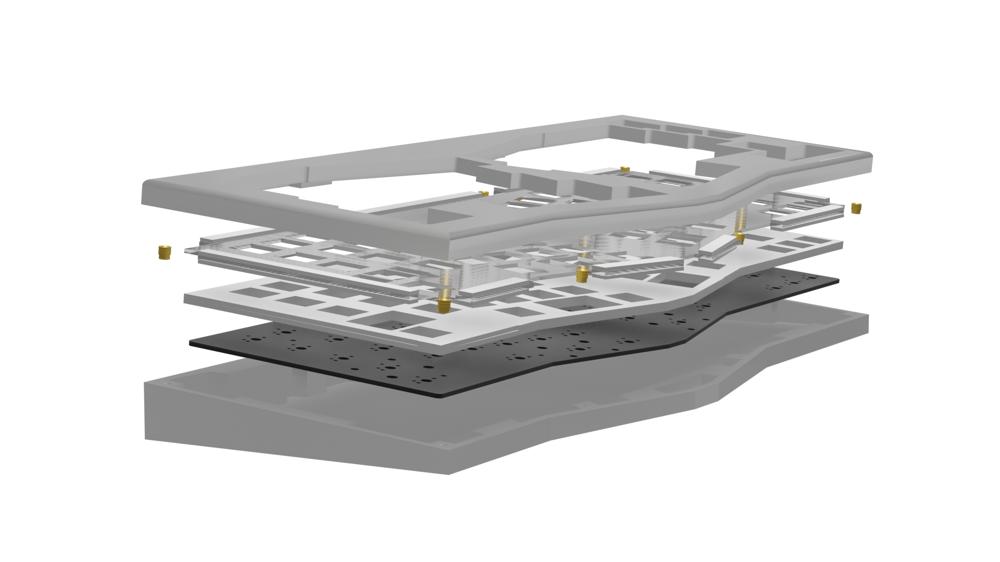

# Blossom

An open-sourced Alice/Arisu style keyboard case. Modified from [FateNozomi's Arisu](https://github.com/FateNozomi/arisu-case)

## Features
- Designed for 3d printing
- Gasket Mounted Desgin using gasket strips on the side of the plate
   - Strip material: Poron Foam or Silicon Rubber
- Includes dxf files of sound dampening material between PCB and plate
- Compatible with [FateNozomi's PCB](https://github.com/FateNozomi/arisu-pcb)

## Layers

## Specifications 

- Dimensions: 30x142x375mm (DxHxW)
- Front Height: 16.5mm
- 5 degree typing angle

#Notes
- **Use the files at your own risk**
- **PCB files are still under development,you can use it, but also at your own risk**

## DIY Guide
#### Things you need: 
| Item  | Image  | Description  | Related Files  | Place to Buy |
| ------------ | ------------ | ------------ | ------------ | ------------ |
| Upper Case * 1  |   | Upper section of the case  | [U_Case.stl](https://github.com/DoughnutTheGuy/Blossom/blob/main/production/case/U_Case.stl)  |  [PCBWay](https://www.pcbway.com/rapid-prototyping/manufacture/?type=2&reffercode=TOP) |
| Lower Case * 1  |   |  Lower Section of the case | [B_Case.stl](https://github.com/DoughnutTheGuy/Blossom/blob/main/production/case/B_Case.stl)  |  [PCBWay](https://www.pcbway.com/rapid-prototyping/manufacture/?type=2&reffercode=TOP) |
|  PCB * 1  |   | Can be chosed from experimental version, which have backlight. Or original FateNozomi's version.  | Original: [gerber](https://github.com/DoughnutTheGuy/Blossom/blob/main/production/pcb/original/arisu-pcb-v1.1-gerber.zip) [bom](https://github.com/DoughnutTheGuy/Blossom/blob/main/production/pcb/original/arisu_bom.csv)  [CPL](https://github.com/DoughnutTheGuy/Blossom/blob/main/production/pcb/original/arisu-all-pos.csv)  Experimental: [gerber](https://github.com/DoughnutTheGuy/Blossom/blob/main/production/pcb/experimental/blossom-pcb.gerber.zip) [BOM](https://github.com/DoughnutTheGuy/Blossom/blob/main/production/pcb/experimental/arisu_bom.csv) [CPL](https://github.com/DoughnutTheGuy/Blossom/blob/main/production/pcb/experimental/arisu-all-pos.csv)| [JLPCB](https://jlcpcb.com) [PCBWay](https://www.pcbway.com) |
| Gasket & Sound Dampening Foam * 1  |   | Can be Poron or Silicon  | [gasket_n_sdl.dxf](https://github.com/DoughnutTheGuy/Blossom/blob/main/production/gasket/gasket_n_sdl.dxf)  | [TaoBao](https://item.taobao.com/item.htm?spm=a230r.1.14.38.46936e836dHYfA&id=637356500647&ns=1&abbucket=9#detail)  |
| Plate * 1 |   | /  |  [plate.dxf](https://github.com/DoughnutTheGuy/Blossom/blob/main/production/plate/plate.dxf) |  [Ponoko](https://www.ponoko.com/materials)  [TaoBao(PC)](https://item.taobao.com/item.htm?spm=a312a.7700824.w4004-18046735553.2.28ff1436zVjIGW&id=565729881968) [SendCutSend](https://sendcutsend.com/)|
| M2.5 Screws * 8 | /  | /  |  / | [Ebay](https://www.ebay.com/sch/i.html?_from=R40&_trksid=p2380057.m570.l1313&_nkw=m2.5+*+4+hex+screws&_sacat=0) [Taobao](https://detail.tmall.com/item.htm?id=18868040917&spm=a1z0k.7385993.0.0.58e537decwL3jP&skuId=4328080057495) |
| M2.5 Insert * 8 | /  | /  |  / |  [Amazon](https://www.amazon.com/Knurled-Threaded-Embedment-Assortment-M2-533-5%EF%BC%88100pcs%EF%BC%89/dp/B07SPWZT5G?th=1) [Taobao](https://detail.tmall.com/item.htm?id=19528296472&spm=a1z0k.7385993.0.0.58e537decwL3jP) |

##### Other things you should probably have : Soldering Iron,  screw driver, switches, Hot Glue(Optional)

###Assembly
------------
**Step 1** - Install the switches into the plate

**Step 2** - place the sound dampening material between the plate and PCB

**Step 3** - Solder the switches
**Step 4** - Stick the gasket of the material of your choice to the extended positions on the plate

**Step 5**  - Install the M2.5 inserts in the 8 positions on the upper case shown below

**Step 6** - Place the plate with the pcb on top of the bottom case

**Step 7** - Cover it with the upper case

**Final Step** - Install screw in the following positions to fix both upper and bottom case

